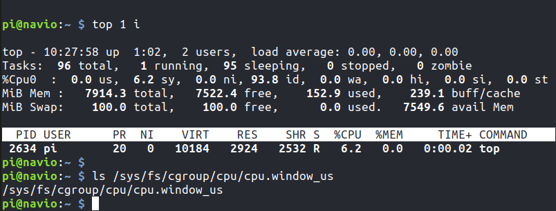

# Artifact evaluation guide

This document describes how to evaluate the in-kernel implementation of the SchedGuard scheduler presented in the paper:

**Note:** It is assumed that the evaluator has basic familiarity with Linux kernel compilation and installing custom kernel. 

**Note:** If there is any difficulties in completing the artifact evaluation, please contact the author for help. More updated guide can be found at this [github repository](https://github.com/jedichen121/linux-rt-rpi/tree/jy/4.19-timer/tools/exp)
## Hardware requirement

To reproduce the experiments, a Raspberry Pi 4B and a microSD card are required . The implementation and experiments are done on a Raspberry Pi 4B 8GB model and verified on a 4GB model.  The implementation has not been tested on previous generation of Raspberry Pi. 

To compile the kernel, a Linux host machine is required.

Unfortunately, due to requirement of accurate timing measurement, the experiments do not work in virtual machines. 

## Preparing the hardware experiments

### SD card preparation

Install the [raspbian lite kernel](http://files.emlid.com/images/emlid-raspbian-20200922.img.xz) to a SD card using the Etcher (provided in attached files).  Modify the `wpa_supplicant.conf` file in the `boot` folder so you can connect the board to WiFi and remote ssh into it. 

A more detailed tutorial can be found [here](https://docs.emlid.com/navio2/common/ardupilot/configuring-raspberry-pi/). Please make sure to use the same image as the author did. 

To ssh into the Raspberry Pi:
```bash
ssh pi@rpi_ip_address
```
The default username and password are `pi` and `raspberry`.

###  Kernel compilation

On a Linux host machine, first install the cross-compilation tool chain.

```bash
sudo apt install git bc bison flex libssl-dev make libc6-dev libncurses5-dev
sudo apt install crossbuild-essential-armhf
```
Obtain the Linux kernel source for the SchedGuard and make sure to use the `jy/4.19-timer` branch.

```bash
git clone https://github.com/jedichen121/linux-rt-rpi.git
cd linux-rt-rpi
git checkout jy/4.19-timer
```

Configure the kernel and compile it for Raspberry Pi 4.
**Note**: To speed up compilation on multiprocessor systems, and get some improvement on single processor ones, use `-j n`, where n is the number of processors * 1.5.
```bash
KERNEL=kernel7l
make ARCH=arm CROSS_COMPILE=arm-linux-gnueabihf- bcm2711_navio2_defconfig
make ARCH=arm CROSS_COMPILE=arm-linux-gnueabihf- zImage modules dtbs -j8
```

###  Install the kernel to the SD Card

First, use `lsblk` before and after plugging in your SD card to identify it. You should end up with something like this:
```
sdb
   sdb1
   sdb2
```
Prepare the folder for installation in the Linux folder:
```bash
mkdir mnt
mkdir mnt/fat32
mkdir mnt/ext4
```

Modify the `install_kernel.sh` (line 2-3) to use the correct partition for the SD card. Then run the script 
```
sudo ./install_kernel.sh
```
A more detailed kernel compilation guide for Raspberry Pi can be found [here](https://www.raspberrypi.org/documentation/linux/kernel/building.md).

###  Additional configurations
The compiled kernel has the name `kernel7l-g` and does not overwrite the original kernel. To use the new kernel, modify `config.txt` in the SD card `boot` path and add the following line to the end of the file:
```
kernel=kernel7l-g.img
```

Because the implementation requires a single core platform, disable all other three cores on the Raspberry Pi by adding the following text to the end of `cmdline.txt` in the SD card `boot` path:
```
maxcpus=1
```
To verify you have booted into the correct kernel and everything is configured correctly, you can use `top 1 i` command (or `top i` and then press `1` to toggle cpu views) and verify you only see `Cpu0`. Then use the following command to see if SchedGuard is installed correctly:
```
ls /sys/fs/cgroup/cpu/cpu.window_us
```


###  Docker installation on Raspberry Pi

```
curl -fsSL https://get.docker.com -o get-docker.sh
sudo sh get-docker.sh
```
After installation, to run Docker as a non-root user
```
sudo groupadd docker
sudo usermod -aG docker $USER
newgrp docker 
```
Verify docker works without `sudo` by running:

```
docker run hello-world
```

### Experiment program compile

Extract and copy the experiment program code to the $HOME path of Raspberry Pi (`/home/pi/`).  A explanation of different files is the following:

- pause_syscall.cpp: the simulated victim task. It runs at 10Hz and has a execution time 20-30ms. It will envoke SchedGuard everytime it finishes execution.
    > To compile: `g++ pause_syscall.cpp -o victim -lrt`.
    
- scheduleak: the attacker program binary. It will try to infer victim runtime initial offset and best case execution time. For more details, please refer to the reference [1] in the SchedGuard paper. 
- run_scheduleak.py: a program to run scheduleak and produce output to a csv file. 
- plot.py: a python program to produce the experimental figures in the paper. 

### Run the code without SchedGuard
The experiment requires two docker container running on Raspberry Pi. It is recommended to connect to the Raspberry Pi using ssh with 2 separate terminals.

In the first terminal, assign enough rt_runtime to docker and start the victim container:
```
sudo sh -c "mkdir /sys/fs/cgroup/cpu/docker"  
sudo sh -c "echo 950000 > /sys/fs/cgroup/cpu/docker/cpu.rt_runtime_us"
docker run -it --rm --privileged --cpu-rt-runtime=550000 -v /home/pi/:/test -w /test jedichen121/rpi_rtps:2.0 bash
```
The first time might take a bit of time as it download the container image.
In the second terminal, start the attacker container:
```
docker run -it --rm --privileged --cpu-rt-runtime=350000 -v /home/pi/:/test -w /test python bash
```
In the victim container, run the victim task for 300s and direct the output to `victim.csv`:
```
./victim -t 300 > victim.csv
```
Then in the attacker container, run the scheduleak attacker program and write the output to `attacker_data.csv`:
```
python run_scheduleak.py -n 110 -o attacker_data.csv
```
Make sure the victim does not finish before the attacker otherwise the attacker will provide wrong results. 

### Run the code with SchedGuard
Exit the attacker container. The victim container does not need to be changed from the previous experiment. Wait for the victim task to finish to make the following changes. Find the id of the victim container, assign a window time of 10ms for it. The first few characters of the id can be found at the victim container command line. 
```
sudo su
echo 10000 > /sys/fs/cgroup/cpu/docker/container_id/cpu.window_us
exit
```

Now start a new attacker container
```
docker run -it --rm --privileged --cpu-rt-runtime=350000 -v /home/pi/:/test -w /test python bash
```

In the victim container, run the victim task again and write the output to `victim_win.csv`:
```
./victim -t 300 > victim_win.csv
```
In the attacker container, run the scheduleak attacker program and write the output to `attacker_data_win.csv`:
```
python run_scheduleak.py -n 110 -o attacker_data_win.csv
```

After both programs have finished, copy the generated four csv files (victim.csv, attacker_data.csv, victim_win.csv, attacker_data_win.csv) back to the Linux host for plotting. 

### Plotting the experimental results

To avoid corrupting the evaluator's environments, it is recommended to use a python virtual environment (optional, not required).

```bash
sudo apt-get install python3-venv
python3 -m venv ./venv
source venv/bin/activate
pip install --upgrade pip
pip install numpy, matplotlib
```
Make sure the `plot.py` is in the same directory with the four csv files. Simply run the `plot.py` file to generate two figures for the paper. 
The `inital.pdf` is comparison of attacker's estimation on victim's initial offset, corresponding to Figure 11 in the paper. There should not be much difference for this image. The `exe_time.pdf` is comparison of attacker's estimation on victim's best case execution time, corresponding to Figure 12 in the paper. The execution time should vary by approximately 10ms for the two cases. 


## Running the simulation experiments
Unzip the `sched_guard_sim.zip` file. Install the python requirements 
```bash
pip3 install -r requirements.txt
```
Simplest method is to use the included shell script. 
```bash

bash ./run_sims.sh

```
Result graphs are shown on screen and saved as pdf files. The graphs are Figure 14, 15 in the paper.

The above scripts might take a long time so the evaluator can modify the runtime parameters according to their hardware specs. 

### Troubleshooting Tips

  

* *Runtime* : The simulations can take a long time to run. The primary controlling factor is the number of tasksets being run. Control this by editing the I parameter in run_sims.sh. 1,000,000 is ideal but 100,000 also produces acceptably smooth results. Lowering the value reduces repeatability as tasksets are generated randomly. On Intel(R) Core(TM) i9-9900 CPU @ 3.10GHz, using all 16 hardware threads 1,000,000 tasksets took 38 minutes to complete.

* The script can end before the progress bar reaches 100%. That is expected and does not impact the simulation itself.
* This is a processor and memory heavy simulation. Two ways to reduce the impact

* *Processor* : By default the simulation uses all available processors. This can be manually controlled using the provided '-j' argument in sched_guard.py. Just edit the run_sims.sh to add -j argument to each invocation of sched_guard.py

* *Memory* : Reducing number of processors also reduces totat concurrent memory usage. Further reducing the number of tasksets (see *Runtime* above) also reduces memory use.